1 _ Create a folder called learn_git.
--->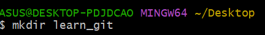
2 _ Cd (change directory) into the learn_git folder.
--->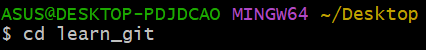
3 _ Create a file called third.txt.
// touch third.txt
--->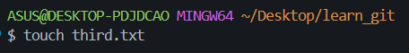
4 _ Initialize an empty git repository.
// git init
---git ->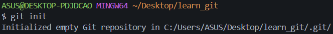
5 _ Add third.txt to the staging area.
// git add third.txt
---git ->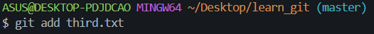
6 _ Commit with the message "adding third.txt".
// git commit -m "adding third.txt"
---git ->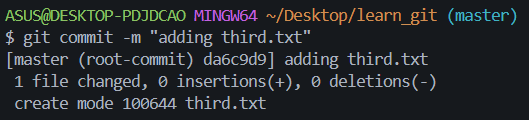
7 _ Check out your commit with git log.
// git log
---git ->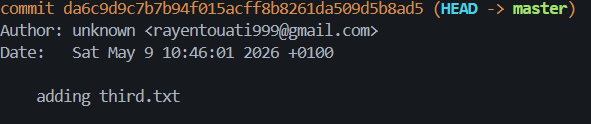
8 _ Create another file called fourth.txt.
// touch fourth.txt
---git->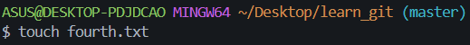
9 _ Add fourth.txt to the staging area.
// git add fourth.txt
---git ->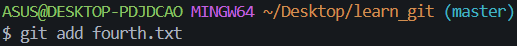
10 _ Commit with the message "adding fourth.txt"
// git commit -m "adding fourth.txt"
---git ->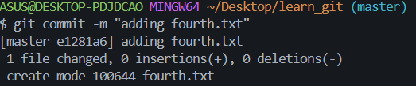
11 _ Remove the third.txt file.
// git rm third.txt
--git->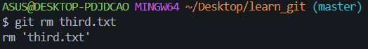
12 _ Add this change to the staging area. (Using the command "git add . "
// git add .
--git->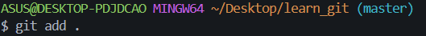
13 _ Commit with the message "removing third.txt".
// git commit -m "removing third.txt"
--git->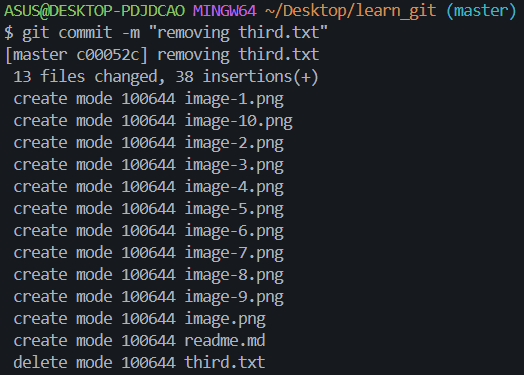
14 _ Check out your commits using git log.
// git log
--git->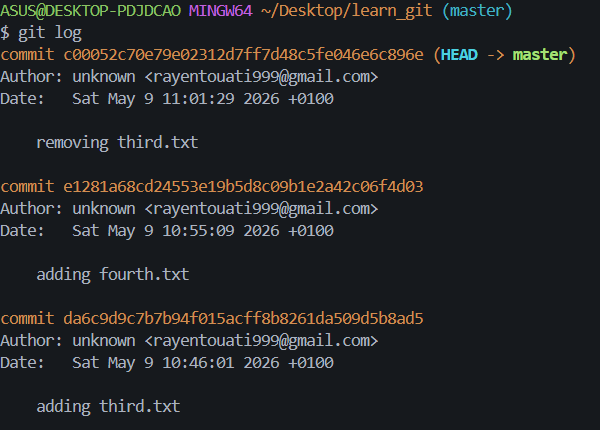
15 _ Change your global settings to core.pager=cat - you can read more about that here.
// git config --global core.pager cat
--git-> 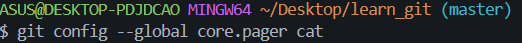
16 _ Write the appropriate command to list all the global configurations for git on your machine.You can type git config --global to find out how to do this.
// git config --global --list
--git->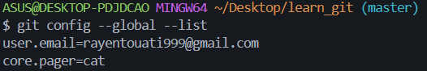

